# Smart Contract Architecture

> Handshake ⇄ Cardano decentralized DNS contracts
>
> This document is the authoritative, diagram-driven description of how the
> on-chain system is structured and how a domain (its ownership, state, and DNS
> records) flows through the contracts. It covers the validator topology,
> the parametric identity ("inheritance") chain, the data model, token/object
> ownership and custody, cryptographic verification, multi-validator
> coordination, and the full lifecycle of a TLD and its subdomains.
>
> Companion doc: [`docs/architecture/validation-method.md`](validation-method.md)
> covers how Handshake domain ownership is cryptographically proven on Cardano.

---

## Table of contents

1. [What the system does](#1-what-the-system-does)
2. [System context](#2-system-context)
3. [The validators at a glance](#3-the-validators-at-a-glance)
4. [Parametric identity: the "inheritance" chain](#4-parametric-identity-the-inheritance-chain)
5. [Data model & type composition](#5-data-model--type-composition)
6. [Tokens & object ownership (custody model)](#6-tokens--object-ownership-custody-model)
7. [Cryptographic verification](#7-cryptographic-verification)
8. [Data flow: the life of a domain](#8-data-flow-the-life-of-a-domain)
9. [Transaction anatomies](#9-transaction-anatomies)
10. [Multi-validator coordination](#10-multi-validator-coordination)
11. [The `minted` reference counter](#11-the-minted-reference-counter)
12. [Linked-list subdomain storage](#12-linked-list-subdomain-storage)
13. [Authority & trust model](#13-authority--trust-model)
14. [Invariants & security properties](#14-invariants--security-properties)
15. [Implementation notes & edge cases](#15-implementation-notes--edge-cases)
16. [Off-chain components](#16-off-chain-components)
17. [Repository map](#17-repository-map)
18. [Glossary](#18-glossary)

---

## 1. What the system does

[Handshake](https://handshake.org/) is a decentralized naming blockchain whose
top-level domains (TLDs) are owned by holders of secp256k1 keys. This project
bridges that ownership onto Cardano so a Handshake TLD owner can register
their domain, manage subdomains (SLDs) and DNS records, and delegate/transfer
control - all as native Cardano assets governed by Aiken (Plutus V3) validators.

The core idea is "verify once, then tokenize":

- Ownership of a Handshake TLD is proven one time with a secp256k1 ECDSA
  signature verified on-chain.
- After that, control is represented by a transferable user token (an NFT).
  All subsequent operations are gated by *possession of that token* rather than
  by re-signing - cheap, delegatable, and wallet-native.

---

## 2. System context

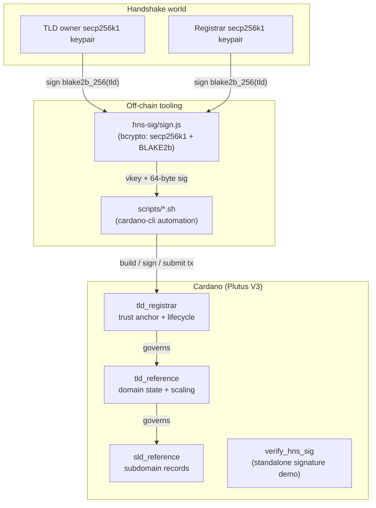

Three validators form the production system; `verify_hns_sig` is an isolated
demonstration of the signature primitive and is not part of the domain
lifecycle.

---

## 3. The validators at a glance

All three production validators are multi-purpose (they expose both a
`spend` and a `mint` handler under one script hash) and are parameterized,
so each on-chain deployment is unique to its parameters.

| Validator | Source | Parameters | Spend datum | Redeemer type | Blueprint hash* |
|-----------|--------|------------|-------------|---------------|-----------------|
| `tld_registrar` | [`tld_registrar.ak`](../../onchain/validators/tld_registration/tld_registrar.ak) | `registrar_hns_key: ByteArray`, `stake_cred: StakeCredential` | `TLDRegisterDatum` | `RegistrarRedeemer` | `f174b191…5302cc` |
| `tld_reference` | [`tld_reference.ak`](../../onchain/validators/tld_registration/tld_reference.ak) | `tld_registrar_policy_id: PolicyId`, `stake_cred: StakeCredential` | `TLDReferenceDatum` | `TLDReferenceAction` | `4b45df7d…555d06` |
| `sld_reference` | [`sld_reference.ak`](../../onchain/validators/tld_registration/sld_reference.ak) | `tld_reference_policy_id: PolicyId`, `stake_cred: StakeCredential` | `SLDReferenceDatum` | `MintSld` (mint) / `Data` (spend) | `8bc1b1ab…1b1c8f` |
| `verify_hns_sig` | [`verify_hns_sig.ak`](../../onchain/validators/verify_hns_sig.ak) | `msg: ByteArray` | n/a (mint-only) | `HNSData` | `b70c6922…2b581fa` |

\* Hashes are the compiled blueprint hashes from
[`onchain/plutus.json`](../../onchain/plutus.json). Because each validator takes
parameters, the *deployed* policy ID / script hash is produced by applying those
parameters at deploy time (`aiken blueprint …` + `cardano-cli`), then used as the
address payment credential together with `stake_cred`.

Responsibilities

- `tld_registrar` - the trust anchor. Verifies the registrar (and, once, the
  owner) Handshake signature, mints the single registration token, and holds
  the authoritative reference counter (`minted`) that gates deregistration.
- `tld_reference` - domain state. Mints/burns the TLD token pair
  (reference + user), stores the subdomain list + DNS records, and scales via a
  linked list of UTxOs (split/merge). Coordinates SLD minting.
- `sld_reference` - subdomain state. Mints/burns the SLD token pair,
  stores per-subdomain DNS records, and refuses to act unless the parent TLD
  reference token is present in the transaction.

### Why three separate validators

The lifecycle is split across three scripts rather than one:

- Modularity: each validator owns exactly one concern (trust anchor and
  lifecycle, domain state and scaling, subdomain records), so each can be
  reasoned about in isolation.
- Fee efficiency: only the scripts relevant to an operation execute. Adding a
  subdomain runs `tld_reference` + `sld_reference` and never pays for registrar
  logic.
- Security isolation: a fault in one layer does not automatically compromise the
  others, and the parametric identity chain
  ([§4](#4-parametric-identity-the-inheritance-chain)) keeps the boundaries
  cryptographically enforced.

---

## 4. Parametric identity: the "inheritance" chain

Aiken has no classes or subtyping. The system's "inheritance" is parametric
identity: each validator's script hash (and therefore its policy ID and
address) is a pure function of its parameters, and those parameters embed the
identity of the layer above. This yields a cryptographically hash-linked
parent → child chain of trust that cannot be forged or re-pointed after
deployment.

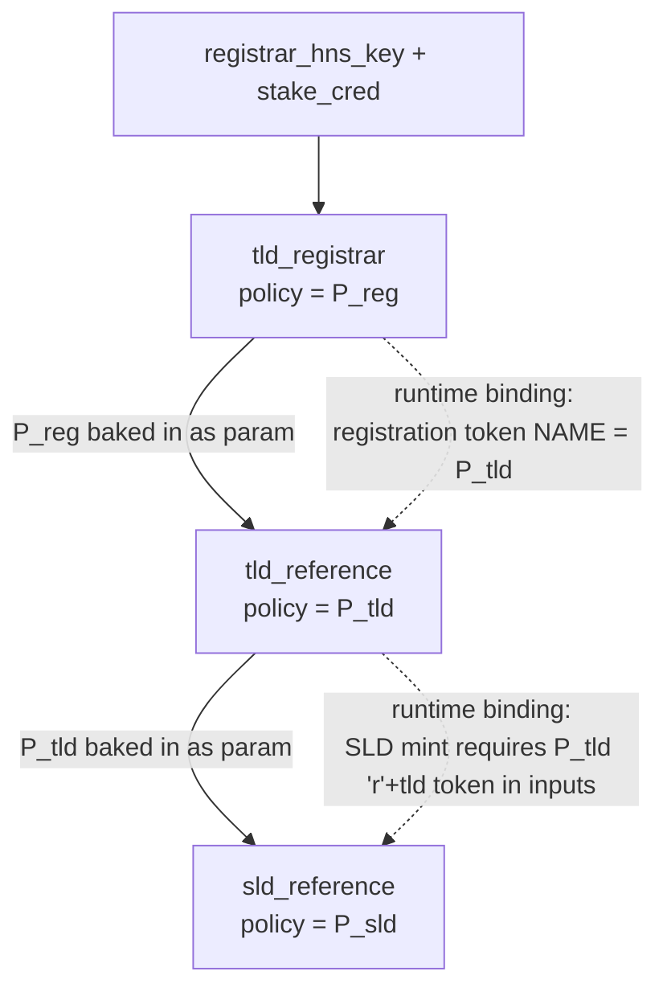

Two complementary bindings hold the layers together:

A. Compile-time parameter inheritance (downward, immutable)

- `tld_reference(tld_registrar_policy_id, …)` - a `tld_reference` script only
  exists *relative to a specific registrar*. `P_tld` is a function of `P_reg`.
- `sld_reference(tld_reference_policy_id, …)` - an `sld_reference` script only
  exists *relative to a specific `tld_reference`*. `P_sld` is a function of
  `P_tld`.

Changing the parent changes the child's hash, so a child can never be
re-parented onto a different (malicious) authority.

B. Runtime identity binding (upward, per-transaction)

- The registration token minted by `tld_registrar` has
  `policy = P_reg` and asset name = `P_tld` (the `tld_reference` policy ID,
  supplied in the `RegisterTLD` redeemer). This lets `tld_reference` locate "its"
  registration UTxO: `get_tld_reference_datum` filters inputs for a token whose
  policy is `tld_registrar_policy_id` and whose name equals its own `policy_id`.
  ([`tld_reference.ak:321`](../../onchain/validators/tld_registration/tld_reference.ak#L321))
- Every `sld_reference` mint/burn requires the parent TLD reference token
  (`P_tld`, name `blake2b_256("r" ++ tld)`) to be present in the transaction
  inputs - `token_in_inputs(inputs, tld_reference_policy_id, …)`.
  ([`sld_reference.ak:76`](../../onchain/validators/tld_registration/sld_reference.ak#L76))

The result is a strict containment hierarchy: an SLD cannot be created without
its TLD present, and a TLD reference cannot exist without a matching
registration.

### Shared-code inheritance

Behavioral reuse (the closest analog to method inheritance) is provided by two
shared library modules that every validator imports:

- [`onchain/lib/utils.ak`](../../onchain/lib/utils.ak) - token-name derivation,
  signature verification, value/output predicates, datum extraction.
- [`onchain/lib/types.ak`](../../onchain/lib/types.ak) - all datums and redeemers.

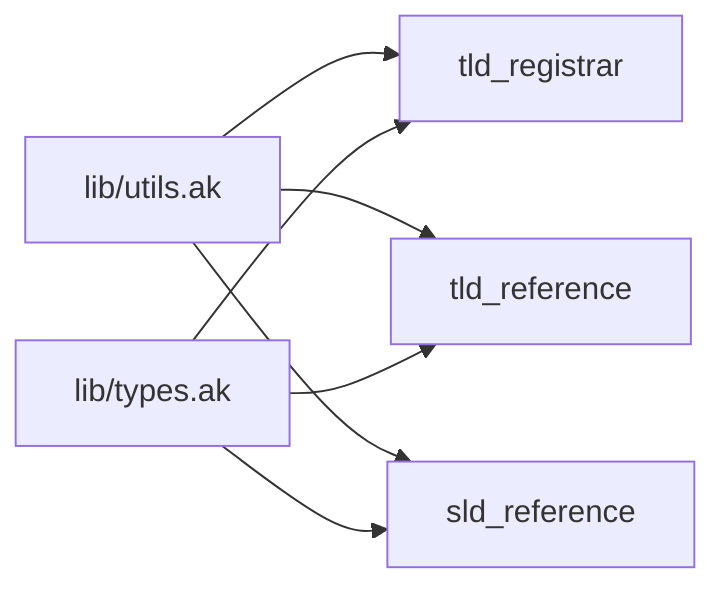

---

## 5. Data model & type composition

All datums and redeemers live in [`lib/types.ak`](../../onchain/lib/types.ak). The
`DNSRecord` type is composed into both the TLD and SLD datums - the single
shared record shape used at every level of the tree.

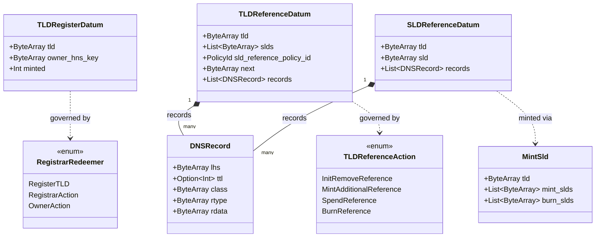

Datum ownership by validator

| Datum | Held at | Purpose |
|-------|---------|---------|
| `TLDRegisterDatum` | `tld_registrar` address | Registration record: TLD name, owner's Handshake vkey, live reference-token count (`minted`). |
| `TLDReferenceDatum` | `tld_reference` address | Domain state: subdomain list (`slds`, sorted+unique), linked-list pointer (`next`), child SLD policy, TLD-level DNS records. |
| `SLDReferenceDatum` | `sld_reference` address | Subdomain state: parent `tld`, `sld` name, per-subdomain DNS records. |

Redeemer → action mapping

| Redeemer | Handler | Effect |
|----------|---------|--------|
| `RegisterTLD{tld, owner, registrar_signature, tld_reference_policy_id}` | registrar `mint` | Register a TLD; mint the registration token. |
| `OwnerAction{owner_signature}` | registrar `spend` | Mint/burn TLD reference tokens; update `minted`. First mint requires the owner signature. |
| `RegistrarAction{registrar_signature}` | registrar `spend`+`mint` | Deregister (burn registration token) once `minted == 0`. |
| `InitRemoveReference` | reference `mint` | Mint (first) or burn (last) the TLD reference/user token pair. |
| `SpendReference` | reference `spend` | Add/remove SLDs and edit TLD records. |
| `MintAdditionalReference` | reference `mint` | Split: 1 UTxO → 2 UTxOs (more datum space). |
| `BurnReference` | reference `mint` | Merge: 2 UTxOs → 1 UTxO. |
| `MintSld{tld, mint_slds, burn_slds}` | sld `mint` | Mint/burn SLD token pairs; write SLD datums. |
| `Data` (any) | sld `spend` | Edit SLD DNS records or burn the SLD. |

---

## 6. Tokens & object ownership (custody model)

Every domain object is a pair of native tokens under the same policy,
distinguished by a one-byte prefix in the pre-image of a BLAKE2b-256 hash
([`utils.ak:15`](../../onchain/lib/utils.ak#L15)):

```
reference token name = blake2b_256("r" ++ name)   // the data-bearing token
user token name      = blake2b_256("u" ++ name)   // the ownership credential
```

| Token | Policy | Name | Quantity | Custodian | Role |
|-------|--------|------|----------|---------------|------|
| Registration | `P_reg` (`tld_registrar`) | `= P_tld` (child policy id) | 1 | `tld_registrar` script | Proof the TLD is registered; carries `minted`. |
| TLD reference | `P_tld` (`tld_reference`) | `blake2b_256("r" ++ tld)` | 1 per UTxO (≥1 after splits) | `tld_reference` script | Carries `TLDReferenceDatum` (state). |
| TLD user | `P_tld` (`tld_reference`) | `blake2b_256("u" ++ tld)` | exactly 1 | owner wallet | Bearer credential to manage the TLD. |
| SLD reference | `P_sld` (`sld_reference`) | `blake2b_256("r" ++ sld)` | 1 per SLD | `sld_reference` script | Carries `SLDReferenceDatum` (records). |
| SLD user | `P_sld` (`sld_reference`) | `blake2b_256("u" ++ sld)` | exactly 1 | owner wallet | Bearer credential to manage the SLD. |

The custody split is the heart of the design:

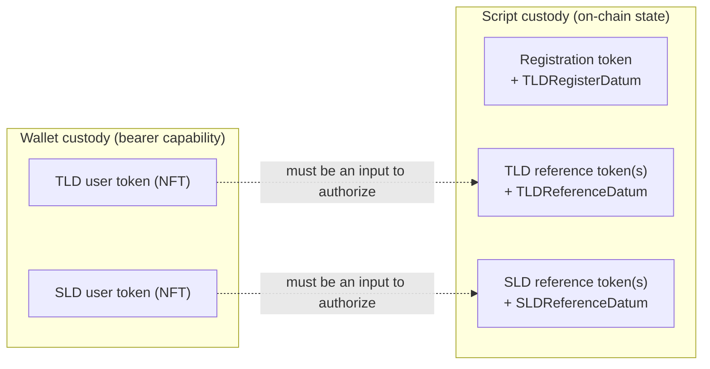

- Reference tokens + datums are custodied by the scripts. They are the
  system's state and never leave validator addresses except to be re-created or
  burned. Reference tokens can be *duplicated across UTxOs* (via split) without
  affecting ownership.
- User tokens are custodied by wallets. They are unique (exactly one each)
  bearer capabilities: whoever holds the user token controls the
  corresponding domain/subdomain. Transferring the token = transferring
  ownership, with no contract interaction. Authorization is enforced by
  requiring the user token to appear among the transaction inputs
  (`token_in_inputs`), not by a `must_be_signed_by` check.

> Ownership transfer / delegation is therefore just a normal UTxO send of the
> user token - compatible with any Cardano wallet, marketplace, or DEX.

### Why a token pair, and why possession-based authority

- Separation of concerns: reference tokens carry state and may be duplicated
  across UTxOs for scaling; user tokens carry authority and stay unique. Splitting
  data from authorization lets a domain's storage be reorganized (split/merge)
  without ever touching ownership.
- Possession as authorization: requiring the user token among the inputs (rather
  than a signature check) makes ownership a transferable bearer right. Transfer or
  temporary delegation is a plain UTxO send (no contract call, no re-signing) and
  composes with existing wallets, marketplaces, and DEXs.
- Uniqueness prevents contested ownership: exactly one user token per name means
  two parties can never both claim control.

---

## 7. Cryptographic verification

Handshake ownership is proven with the Plutus V3 built-in
`verify_ecdsa_secp256k1_signature`. The message is the BLAKE2b-256 hash of the
TLD ([`utils.ak:23`](../../onchain/lib/utils.ak#L23)):

```aiken
pub fn verify_tld_signature(verification_key, tld, signature) -> Bool {
  verify_ecdsa_secp256k1_signature(
    verification_key,          // 33-byte compressed secp256k1 pubkey
    blake2b_256(tld),          // 32-byte message digest
    signature,                 // 64-byte r || s (no recovery byte)
  )
}
```

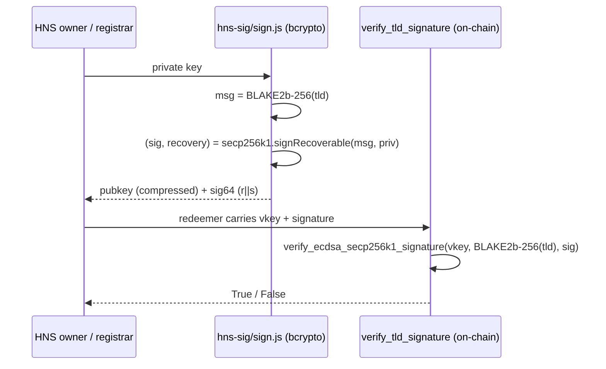

The off-chain generator [`hns-sig/sign.js`](../../hns-sig/sign.js) uses `bcrypto` to
produce exactly this shape (compressed pubkey, `BLAKE2b` digest,
`signRecoverable` with the recovery byte stripped to a 64-byte `r||s`).

Where verification runs. Only `tld_registrar` verifies signatures, and only
along two paths:

- `RegistrarAction` (deregister) - requires a valid registrar signature.
- `OwnerAction` when `minted == 0` (first activation) - requires a valid
  owner signature. When `minted != 0`, no signature is checked; the user
  token is the sole authority.

The standalone [`verify_hns_sig`](../../onchain/validators/verify_hns_sig.ak)
validator is a minimal mint policy that verifies a signature over a fixed `msg`
parameter - a self-contained demo of the primitive, unused by the domain system.

---

## 8. Data flow: the life of a domain

The complete lifecycle, showing which redeemers drive each transition and how
the `minted` counter moves:

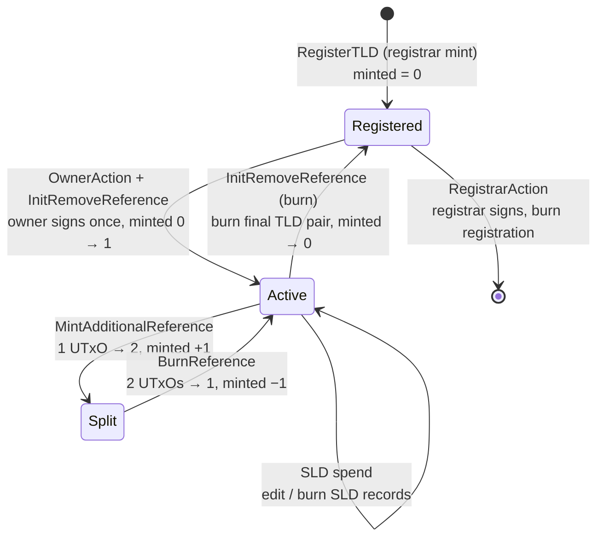

How a domain's data flows through the layers

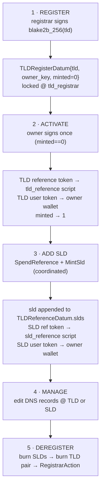

---

## 9. Transaction anatomies

Each core operation is a single atomic transaction. The tables below show the
exact inputs / outputs / mint / redeemers the validators enforce (mirroring the
`scripts/0X-*.sh` demos and the Aiken tests).

### 9.1 Register a TLD - `RegisterTLD` (registrar `mint`)

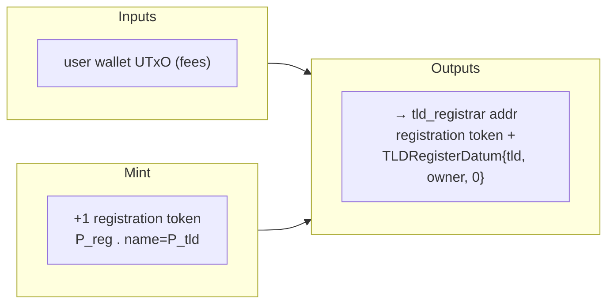

Checks ([`tld_registrar.ak:100`](../../onchain/validators/tld_registration/tld_registrar.ak#L100)):
registrar signature valid · exactly one registration token minted
(`single_value`) · output returns to the registrar's own address (Script(P_reg)
+ `stake_cred`) with datum `minted = 0`.

### 9.2 Activate - `OwnerAction` (registrar `spend`) + `InitRemoveReference` (reference `mint`)

| | Inputs | Mint | Outputs |
|-|--------|------|---------|
| tokens | registration UTxO; wallet fees | +1 `blake2b_256("r"++tld)`; +1 `blake2b_256("u"++tld)` (both `P_tld`) | registration UTxO re-created with `minted=1`; TLD reference token → `tld_reference` addr with `TLDReferenceDatum{tld, [], P_sld, "", []}`; TLD user token → owner wallet |

Checks: owner signature valid because `minted == 0`; `new_minted = 0 + 1`;
registration output re-created with the incremented counter
([`tld_registrar.ak:55`](../../onchain/validators/tld_registration/tld_registrar.ak#L55)).
`InitRemoveReference` (minted==0 branch): output datum has `slds == []`,
`next == ""`; mint is exactly `+1 r` and `+1 u`
([`tld_reference.ak:117`](../../onchain/validators/tld_registration/tld_reference.ak#L117),
`check_init_minting`).

### 9.3 Add a subdomain - `SpendReference` (reference `spend`) + `MintSld` (sld `mint`)

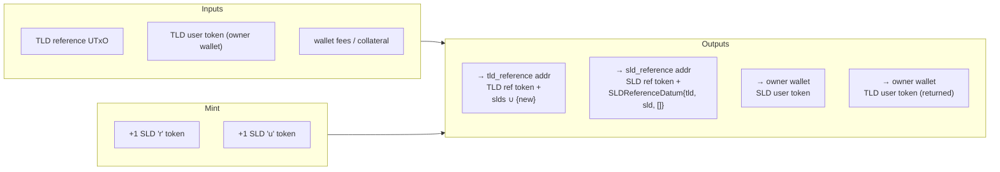

Redeemers present in the same transaction:
`Spend(TLD ref) = SpendReference` and
`Mint(P_sld) = MintSld(tld, [new_sld], [])`. See
[§10](#10-multi-validator-coordination) for how the two validators cross-check.

### 9.4 Edit DNS records - `SpendReference` (TLD level) or `Data` spend (SLD level)

- TLD records: `SpendReference` with `slds` unchanged (so no SLD mint is
  triggered) and only `records` edited.
- SLD records: spend the SLD reference UTxO with the SLD user token present;
  output re-creates the SLD UTxO with the same `tld`/`sld` and updated `records`
  (records are unconstrained → freely editable)
  ([`sld_reference.ak:26`](../../onchain/validators/tld_registration/sld_reference.ak#L26)).

### 9.5 Split - `MintAdditionalReference` (see [§12](#12-linked-list-subdomain-storage))

One TLD reference UTxO in → two out; mint exactly `+1` TLD reference token; the
two outputs partition the SLDs and re-link. Requires `minted != 0` (`not_first`).

### 9.6 Merge - `BurnReference` (see [§12](#12-linked-list-subdomain-storage))

Two TLD reference UTxOs in → one out; burn exactly `−1` TLD reference token;
combined SLD list preserved and re-linked. Guard: `minted == 1` (`not_last`).

### 9.7 Deregister - burn TLD pair, then `RegistrarAction`

1. Burn every SLD pair (each needs its SLD user token).
2. Merge down to a single TLD reference UTxO.
3. `InitRemoveReference` (minted != 0 branch) burns the final `r`+`u` pair; the
   accompanying `OwnerAction` drives `minted → 0`.
4. `RegistrarAction` (spend + mint): registrar signs, no registration token in
   outputs (`all_burned`), and `minted == 0` - only then is the registration
   token burned and the TLD released
   ([`tld_registrar.ak:37`](../../onchain/validators/tld_registration/tld_registrar.ak#L37)).

---

## 10. Multi-validator coordination

Adding or removing a subdomain must update two pieces of state atomically:
the parent's `slds` list (in `tld_reference`) and the SLD token pair + datum (in
`sld_reference`). Neither validator trusts the other's execution directly;
instead they cross-reference each other's presence in the same transaction
via redeemer inspection and token-in-input checks.

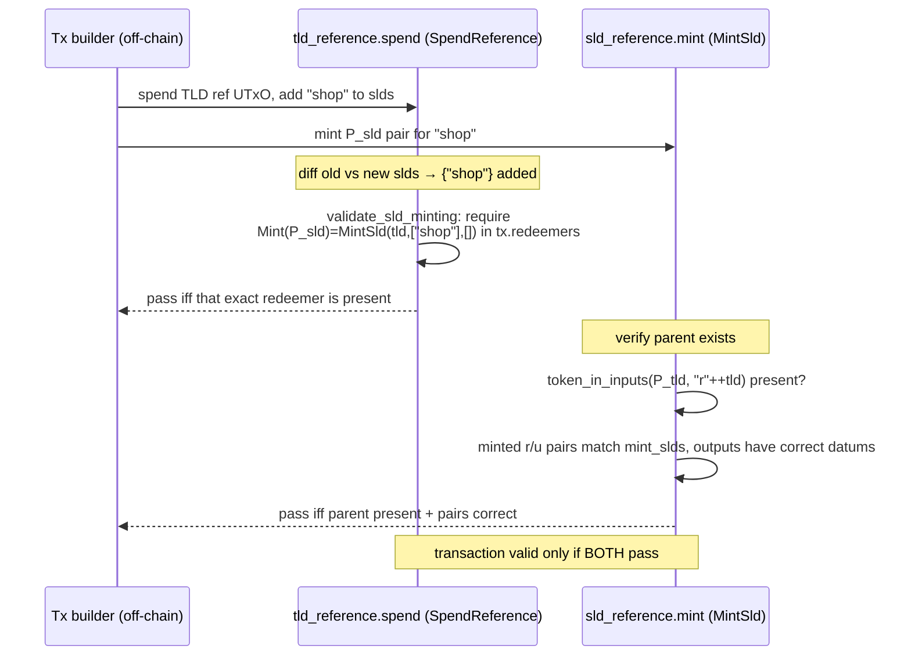

- `tld_reference` asserts: *"if the SLD set changed, a matching `MintSld`
  redeemer must exist."* `validate_sld_minting` computes
  `difference(new, old)` / `difference(old, new)` and requires the exact
  `Pair(Mint(P_sld), MintSld(tld, mints, burns))` to appear in `tx.redeemers`; if
  nothing changed, it requires zero SLD-policy tokens in the mint
  ([`tld_reference.ak:287`](../../onchain/validators/tld_registration/tld_reference.ak#L287)).
- `sld_reference` asserts: *"if I mint, the parent TLD reference token is an
  input, the mint size equals `(|mints|+|burns|)·2`, each minted SLD has its
  output datum, each burned SLD is `−1`."*
  ([`sld_reference.ak:53`](../../onchain/validators/tld_registration/sld_reference.ak#L53)).

Together these prevent both failure modes: a "ghost" SLD in the list with no
tokens, and an "orphan" SLD token with no parent entry.

### Why redeemer coordination (vs. a shared state token)

The two validators could instead have been synchronized with an extra on-chain
"state token" handed between them. Redeemer coordination was chosen because:

- It adds no tokens and no extra UTxO plumbing: the check is a pure inspection of
  `tx.redeemers` and inputs already present.
- It is symmetric and atomic: each side independently refuses unless the other's
  intent is declared in the same transaction, so a partial update cannot commit.
- It keeps script size and execution cost lower than threading and validating an
  additional stateful asset.

---

## 11. The `minted` reference counter

`TLDRegisterDatum.minted` is the authoritative count of TLD reference tokens and
the gate that prevents premature deregistration. It is only mutated by the
registrar's `OwnerAction` path, which recomputes
`new_minted = minted + tld_reference_mint_am` from the actual mint value and
re-locks the registration UTxO
([`tld_registrar.ak:76`](../../onchain/validators/tld_registration/tld_registrar.ak#L76)).

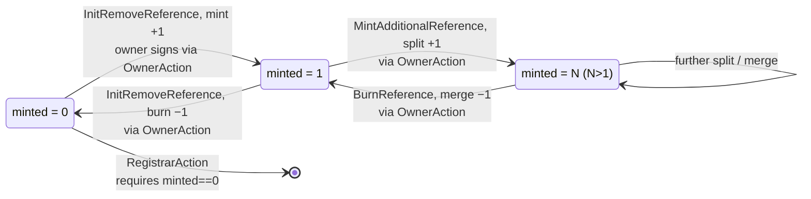

Guards enforced on the mint side of `tld_reference`:

| Redeemer | Guard | Meaning |
|----------|-------|---------|
| `InitRemoveReference` | branch on `minted == 0` | `0` → mint the initial pair; otherwise burn the final pair. |
| `MintAdditionalReference` | `not_first = (minted != 0)` | Cannot split before the domain is initialized. |
| `BurnReference` | `not_last = (minted == 1)` | Merge path (see the note in [§15](#15-implementation-notes--edge-cases)). |
| `RegistrarAction` | `minted == 0` | Deregistration only when all references are gone. |

Because these mint-side handlers read `minted` from a spent registration
input, the registrar's `spend` validator necessarily runs in the same
transaction - that is how the counter stays coupled to the actual token supply.

---

## 12. Linked-list subdomain storage

Cardano caps datum size, so a TLD's subdomains are distributed across a sorted
singly-linked list of UTxOs, each holding one TLD reference token and a subset
of SLDs. The `next` field points to the first (smallest) SLD of the following
node; the tail node has `next == ""`.

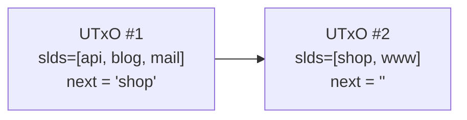

Invariants (`slds_sort_unique`,
[`tld_reference.ak:335`](../../onchain/validators/tld_registration/tld_reference.ak#L335)):
within every node `slds` is strictly sorted and unique; across nodes the global
order is preserved; the chain is acyclic and terminates with `""`.

### Split - `MintAdditionalReference`

```
in : slds=[a,b,c] next=X
out1: slds=[a,b]  next='c'     (points into out2)
out2: slds=[c]    next=''      (terminator)
mint: +1 TLD reference token
```

The validator requires exactly one reference-token input and exactly two
reference-token outputs at its own address, `concat(out1.slds, out2.slds)`
unchanged from the input set (so `validate_sld_minting` demands no SLD mint),
each output sorted+unique, and the two outputs correctly re-linked so one is
"first" and the other terminates the chain
([`tld_reference.ak:144`](../../onchain/validators/tld_registration/tld_reference.ak#L144)).

### Merge - `BurnReference`

```
in1 : slds=[a,b] next='c'
in2 : slds=[c]   next=Y
out : slds=[a,b,c] next=Y      (inherits the surviving tail pointer)
mint: −1 TLD reference token
```

The validator requires exactly two reference-token inputs and one output, the
combined SLD set preserved and sorted+unique, `sld_reference_policy_id`
unchanged, and `next` re-stitched so the merged node inherits the correct onward
pointer ([`tld_reference.ak:217`](../../onchain/validators/tld_registration/tld_reference.ak#L217)).

### Why a linked list (vs. a Merkle tree)

Cardano datums are size-bounded, so a large `slds` set must be distributed across
UTxOs. A sorted linked list was chosen over a Merkle / authenticated tree
because:

- It maps naturally onto the UTxO model: one UTxO is one node, and growth needs
  no pre-allocation.
- Split and merge are the native UTxO operations (1 input to 2 outputs, 2 inputs
  to 1 output) and need only local pointer checks, not tree rebalancing.
- Lexicographic ordering across nodes lets off-chain resolvers traverse the whole
  domain in order for efficient lookups.

A Merkle tree would give succinct inclusion proofs, but at the cost of complex
rebalancing and proof-maintenance logic inside the UTxO model, which this design
deliberately avoids.

---

## 13. Authority & trust model

Three authority tiers, each strictly weaker/narrower than the one that grants it:

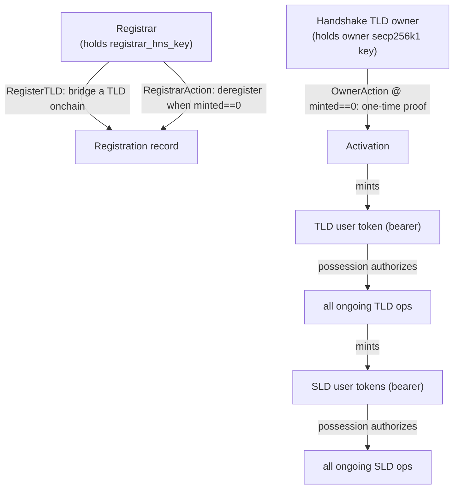

- Registrar is the trust anchor: it decides which Handshake TLDs may be
  bridged (signature over the TLD) and is the only party that can finally release
  a registration - but only when the domain is fully wound down (`minted == 0`).
  It cannot spend or alter an owner's live domain state.
- Owner proves Handshake ownership exactly once (`OwnerAction` while
  `minted == 0`). After that the owner's on-chain authority is embodied entirely
  by the TLD user token.
- Token bearers hold capability NFTs. Control follows the token, enabling
  transfer and delegation without any signature or registrar involvement.

---

## 14. Invariants & security properties

Enforced by the validators:

- Registration ↔ counter coupling. A TLD can be deregistered only when
  `minted == 0` and no registration token survives in outputs
  (`all_burned`) - no orphaned registrations, no premature release.
- One-time cryptographic proof. The owner signature is checked exactly once
  (first activation); thereafter authority is the user token.
- Custody separation. Reference tokens (state) stay at scripts; user tokens
  (authority) are unique bearer NFTs. `single_value` / `check_init_minting` pin
  mint quantities to `1`/`−1` and forbid no-op mints.
- Address & shape pinning. Outputs must return to the validator's own
  `Address(Script(policy_id), Some(stake_cred))`, carry exactly ada + one native
  token (`two_token_value`), and have no reference script
  (`is_none(reference_script)`).
- Atomic SLD coordination. SLD set changes require the matching `MintSld`
  redeemer; SLD minting requires the parent TLD reference token in inputs
  ([§10](#10-multi-validator-coordination)).
- Ordered, unique subdomains. `slds_sort_unique` on every reference output.
- Catch-all denial. Each validator's `else(_) { fail }` rejects every purpose
  and redeemer path not explicitly handled.

Relied upon from the environment:

- BLAKE2b-256 collision resistance for token-name and message uniqueness.
- secp256k1 ECDSA soundness (the Plutus V3 built-in).
- Correct, unique parameterization at deploy time (a shared `stake_cred` and the
  correct parent policy IDs) - this is what makes the identity chain in
  [§4](#4-parametric-identity-the-inheritance-chain) meaningful.

---

## 15. Implementation notes & edge cases

These are precise observations about the code as written - useful when
extending, auditing, or building off-chain tooling. They describe behavior, not
recommendations.

- `BurnReference` (merge) guard is `minted == 1`. The variable is named
  `not_last`, but the check is literal equality with `1`
  ([`tld_reference.ak:252`](../../onchain/validators/tld_registration/tld_reference.ak#L252)).
  The merge tests exercise it with a registration datum whose `minted == 1`
  ([`tests/tld_reference.ak:116`](../../onchain/validators/tld_registration/tests/tld_reference.ak#L116)).
  The unit tests validate each validator in isolation and do not drive the
  registrar's `OwnerAction` concurrently, so the coupling between split/merge
  mint deltas and the `minted` counter is not exercised end-to-end in the test
  suite. Anyone composing real split/merge transactions on chains longer than two
  nodes should verify the counter arithmetic against `OwnerAction` for their
  specific case.
- Split does not re-read the input's `next`. `MintAdditionalReference`
  destructures the input datum with `..` and does not constrain the input's prior
  `next`; it only enforces that the two outputs link to each other and one
  terminates with `""`
  ([`tld_reference.ak:168`](../../onchain/validators/tld_registration/tld_reference.ak#L168)).
  It is therefore shaped for splitting a terminal (or single) node.
- SLD records are unconstrained on spend. The SLD spend path checks the
  reference token, the user token, and the datum's `tld`/`sld`, but not
  `records`, so DNS records are freely editable (by design).
- Two `check_output_exist` helpers exist. One in
  [`utils.ak:35`](../../onchain/lib/utils.ak#L35) (datum-equality form) and one local to
  [`sld_reference.ak:99`](../../onchain/validators/tld_registration/sld_reference.ak#L99)
  (field-equality form). They are different functions with the same name in
  different modules.
- Owner signature is not checked at `RegisterTLD`. Registration verifies only
  the *registrar* signature and stores `owner` from the redeemer into the datum;
  the *owner* signature is verified later at first `OwnerAction`
  (`minted == 0`).

---

## 16. Off-chain components

| Component | Path | Role |
|-----------|------|------|
| Signature generator | [`hns-sig/sign.js`](../../hns-sig/sign.js) | Produce secp256k1 vkey + `BLAKE2b`-hashed message + 64-byte signature via `bcrypto`. |
| Env & helpers | [`scripts/env.sh`](../../scripts/env.sh) | Paths, `create_reference_token_tn` / `create_user_token_tn` (mirrors on-chain naming with `b2sum`), UTxO lookup helpers. |
| Wallet setup | [`scripts/create-user.sh`](../../scripts/create-user.sh) | Generate payment + stake keys/addresses. |
| Deploy validators | [`scripts/create-validator-addrs.sh`](../../scripts/create-validator-addrs.sh) | Convert blueprints to `.plutus`, build script addresses (shared registrar stake key). |
| 1 · Init | [`scripts/01-init-system.sh`](../../scripts/01-init-system.sh) | Publish the three validators as reference scripts. |
| 2 · Register | [`scripts/02-register-tld.sh`](../../scripts/02-register-tld.sh) | `RegisterTLD` mint + registration datum. |
| 3 · Activate | [`scripts/03-mint-tld.sh`](../../scripts/03-mint-tld.sh) | `OwnerAction` + `InitRemoveReference`; mint TLD pair. |
| 4 · Add SLD | [`scripts/04-mint-sld.sh`](../../scripts/04-mint-sld.sh) | `SpendReference` + `MintSld`; append SLD, mint SLD pair. |

The scripts deploy each validator once as a reference script (step 1) and
then reference it by `TxIn` in later transactions - keeping per-transaction size
and fees low.

---

## 17. Repository map

```
onchain/                                   # Aiken smart contracts (Plutus V3)
  aiken.toml, plutus.json                  # config + compiled blueprint
  lib/
    types.ak                               # datums, redeemers, DNSRecord
    utils.ak                               # token names, sig verify, value/output predicates
    constants.ak                           # test keys/sigs/addresses
    test_utils.ak                          # mock outputs/utxos for tests
  validators/
    verify_hns_sig.ak                      # standalone secp256k1 demo
    tld_registration/
      tld_registrar.ak                     # Layer 1 - trust anchor + lifecycle
      tld_reference.ak                     # Layer 2 - domain state + scaling
      sld_reference.ak                     # Layer 3 - subdomain records
      tests/                               # per-validator unit tests
hns-sig/                                   # Node.js signature generation (bcrypto)
scripts/                                   # cardano-cli automation (env + 01..04)
preprod/                                   # testnet artifacts (validators, wallets, tx)
docs/
  architecture/smart-contract-architecture.md  # this document (master overview)
  architecture/validation-method.md        # ownership-proof narrative
  research/                                # Handshake / secp256k1 background
```

---

## 18. Glossary

| Term | Meaning |
|------|---------|
| TLD | Top-level domain owned on Handshake (e.g. `hello-handshake`). |
| SLD | Subdomain under a TLD. |
| Registration token | The `tld_registrar` NFT whose name is the child `tld_reference` policy ID; carries `TLDRegisterDatum`. |
| Reference token | `blake2b_256("r" ++ name)` - data-bearing token, held at a validator. |
| User token | `blake2b_256("u" ++ name)` - unique bearer NFT authorizing operations, held in a wallet. |
| `minted` | Live count of TLD reference tokens; deregistration requires `0`. |
| `next` | Linked-list pointer to the first SLD of the following reference UTxO (`""` = tail). |
| `P_reg` / `P_tld` / `P_sld` | Policy IDs of `tld_registrar` / `tld_reference` / `sld_reference`. |
| Parametric identity | Each validator's hash is a function of its parameters, embedding the parent's identity - the system's "inheritance". |

---

*Generated from the contract sources under `onchain/`. When the validators
change, update the diagrams and the guard tables in
[§9](#9-transaction-anatomies) to [§12](#12-linked-list-subdomain-storage) alongside
the code.*
